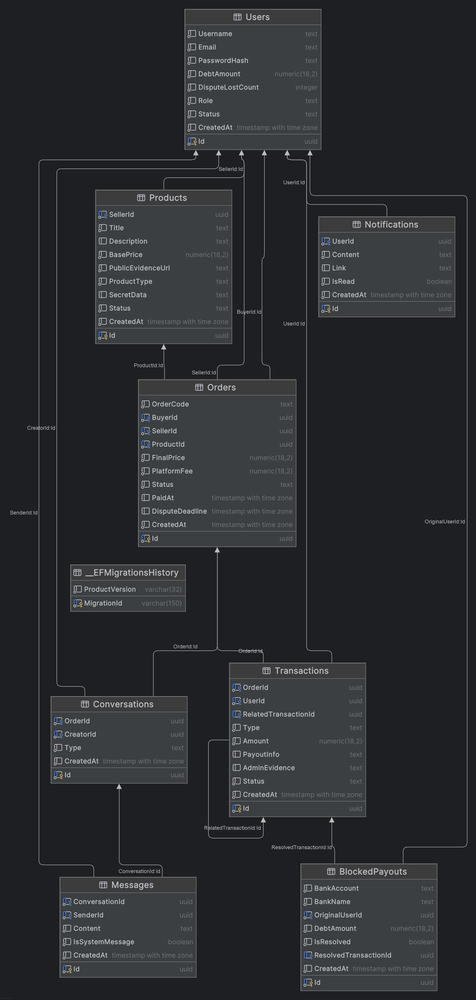

# Database Design - Swaptem

## 1. Overview
- **Database Engine:** PostgreSQL (Latest)
- **Environment:** Docker Container
- **ORM:** Entity Framework Core (Code-First)

## 2. Key Design Decisions
- **UUID:** Sử dụng `uuid` (GUID) làm Primary Key (`Id`) cho toàn bộ bảng để bảo mật, tránh enumeration attacks và dễ dàng scale/merge data giữa các hệ thống phân tán.
- **Money Handling:** Sử dụng kiểu dữ liệu `numeric(18,2)` (tương đương `decimal(18,2)` trong C#) để đảm bảo độ chính xác tuyệt đối cho các trường tiền tệ như `DebtAmount`, `BasePrice`, `FinalPrice`, `PlatformFee`, `Amount`.
- **Enums:** Các trạng thái và phân loại (Status, Role, Type) được lưu dưới dạng `text` trong PostgreSQL để dễ đọc (Human-readable) và dễ debug. Entity Framework Core sẽ map sang C# Enum.
- **Timestamp:** Sử dụng `timestamp with time zone` cho tất cả các trường thời gian (`CreatedAt`, `PaidAt`, `DisputeDeadline`) để đảm bảo tính nhất quán khi hệ thống hoạt động đa múi giờ.
- **Self-Referencing:** Bảng `Transactions` có trường `RelatedTransactionId` (FK tự tham chiếu) để truy vết chuỗi giao dịch liên quan (ví dụ: REFUND trỏ về DEPOSIT gốc).
- **Nullable Fields:** Một số trường có thể null như `OrderId`, `RelatedTransactionId`, `ResolvedTransactionId` để linh hoạt trong các trường hợp đặc biệt.

## 3. Core Tables

### 3.1. Users
Quản lý thông tin người dùng, authentication và số dư nợ.
- **Khóa chính:** `Id` (uuid)
- **Các trường chính:**
  - `Username` (text): Tên đăng nhập duy nhất
  - `Email` (text): Email đăng ký, dùng cho authentication và notification
  - `PasswordHash` (text): Mật khẩu đã băm (bcrypt/argon2)
  - `DebtAmount` (numeric 18,2): Số tiền User nợ sàn (mặc định 0)
  - `DisputeLostCount` (integer): Số lần thua tranh chấp (để đánh giá độ tin cậy)
  - `Role` (text): Vai trò - `ADMIN`, `MEMBER`
  - `Status` (text): Trạng thái tài khoản - `ACTIVE`, `BANNED`, `DEACTIVATED`
  - `CreatedAt` (timestamp with time zone): Thời gian tạo tài khoản

### 3.2. Products
Sản phẩm số (File/Account) được đăng bán trên sàn.
- **Khóa chính:** `Id` (uuid)
- **Foreign Keys:** `SellerId` → `Users.Id`
- **Các trường chính:**
  - `Title` (text): Tiêu đề sản phẩm
  - `Description` (text): Mô tả chi tiết
  - `BasePrice` (numeric 18,2): Giá niêm yết gốc
  - `PublicEvidenceUrl` (text): Link ảnh/video minh chứng công khai (không chứa thông tin nhạy cảm)
  - `ProductType` (text): Loại sản phẩm - `FILE`, `ACCOUNT`
  - `SecretData` (text): Dữ liệu bí mật (link download, tài khoản/mật khẩu) - chỉ hiển thị sau khi mua
  - `Status` (text): Trạng thái - `AVAILABLE`, `SOLD`, `HIDDEN`
  - `CreatedAt` (timestamp with time zone): Thời gian đăng sản phẩm

### 3.3. Orders
Đơn hàng phát sinh khi Buyer mua Product từ Seller.
- **Khóa chính:** `Id` (uuid)
- **Foreign Keys:** 
  - `BuyerId` → `Users.Id`
  - `SellerId` → `Users.Id`
  - `ProductId` → `Products.Id`
- **Các trường chính:**
  - `OrderCode` (text): Mã đơn hàng duy nhất để tracking (ví dụ: `ORD-20260213-XXXX`)
  - `FinalPrice` (numeric 18,2): Giá cuối cùng (có thể thương lượng khác `BasePrice`)
  - `PlatformFee` (numeric 18,2): Phí sàn trừ vào người bán
  - `Status` (text): Trạng thái đơn hàng - `CREATED`, `PAID`, `DISPUTED`, `COMPLETED`, `REFUNDED`, `CANCELLED`
  - `PaidAt` (timestamp with time zone): Thời điểm Buyer thanh toán
  - `DisputeDeadline` (timestamp with time zone): Hạn chốt để mở tranh chấp
  - `CreatedAt` (timestamp with time zone): Thời gian tạo đơn

### 3.4. Transactions
Lịch sử dòng tiền trong hệ thống (Nạp, Rút, Hoàn, Trừ nợ).
- **Khóa chính:** `Id` (uuid)
- **Foreign Keys:**
  - `OrderId` → `Orders.Id` (nullable, chỉ có khi giao dịch phát sinh từ Order)
  - `UserId` → `Users.Id`
  - `RelatedTransactionId` → `Transactions.Id` (nullable, self-referencing để truy vết giao dịch gốc)
- **Các trường chính:**
  - `Type` (text): Loại giao dịch - `DEPOSIT`, `PAYOUT`, `REFUND`, `DEBT_DEDUCTION`
  - `Amount` (numeric 18,2): Số tiền giao dịch (dương/âm tùy Type)
  - `PayoutInfo` (text): Thông tin rút tiền (số tài khoản, ngân hàng)
  - `AdminEvidence` (text): Bằng chứng từ Admin (screenshot chuyển khoản, lý do từ chối)
  - `Status` (text): Trạng thái - `PENDING`, `SUCCESS`, `FAILED`
  - `CreatedAt` (timestamp with time zone): Thời gian tạo giao dịch

### 3.5. Conversations
Hội thoại giữa các bên liên quan đến Order.
- **Khóa chính:** `Id` (uuid)
- **Foreign Keys:**
  - `OrderId` → `Orders.Id`
  - `CreatorId` → `Users.Id` (người khởi tạo cuộc hội thoại)
- **Các trường chính:**
  - `Type` (text): Loại hội thoại - `NEGOTIATION` (thương lượng giá), `ORDERCHAT` (chat sau khi mua), `SELFRESOLVE` (tự giải quyết), `DISPUTE` (tranh chấp có Admin tham gia)
  - `CreatedAt` (timestamp with time zone): Thời gian tạo cuộc hội thoại

### 3.6. Messages
Tin nhắn trong Conversation.
- **Khóa chính:** `Id` (uuid)
- **Foreign Keys:**
  - `ConversationId` → `Conversations.Id`
  - `SenderId` → `Users.Id`
- **Các trường chính:**
  - `Content` (text): Nội dung tin nhắn
  - `IsSystemMessage` (boolean): `true` nếu là tin nhắn tự động từ hệ thống (ví dụ: "Order đã được thanh toán")
  - `CreatedAt` (timestamp with time zone): Thời gian gửi tin nhắn

### 3.7. Notifications
Thông báo gửi đến User (Email/In-app).
- **Khóa chính:** `Id` (uuid)
- **Foreign Keys:** `UserId` → `Users.Id`
- **Các trường chính:**
  - `Content` (text): Nội dung thông báo
  - `Link` (text): Link đến trang liên quan (Order, Transaction, v.v.)
  - `IsRead` (boolean): Đã đọc hay chưa
  - `CreatedAt` (timestamp with time zone): Thời gian tạo thông báo

### 3.8. BlockedPayouts
Cơ chế chặn rút tiền khi User nợ sàn và rút tiền về tài khoản khác để trốn nợ.
- **Khóa chính:** `Id` (uuid)
- **Foreign Keys:**
  - `OriginalUserId` → `Users.Id` (User gốc đã nợ)
  - `ResolvedTransactionId` → `Transactions.Id` (nullable, giao dịch thanh toán nợ để mở khóa)
- **Các trường chính:**
  - `BankAccount` (text): Số tài khoản ngân hàng bị chặn
  - `BankName` (text): Tên ngân hàng
  - `DebtAmount` (numeric 18,2): Số tiền nợ tại thời điểm chặn
  - `IsResolved` (boolean): Đã giải quyết (thanh toán nợ) hay chưa
  - `CreatedAt` (timestamp with time zone): Thời gian tạo record block

## 4. Entity Relationship Diagram (ERD)
