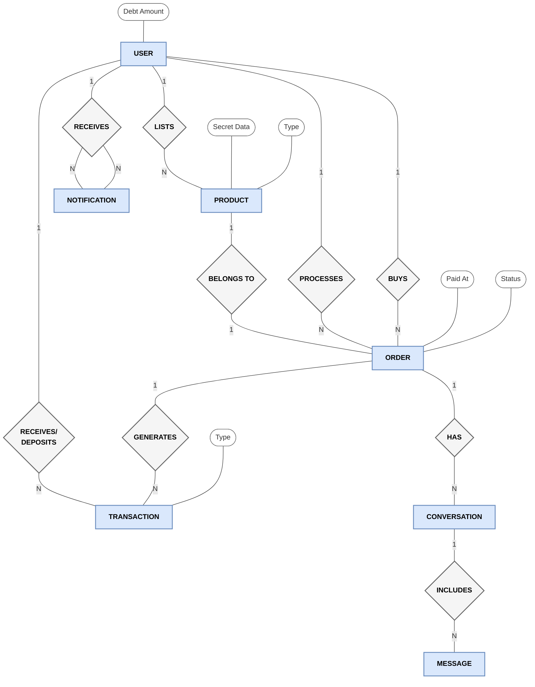

```mermaid
flowchart TD
    %% --- STYLE DEFINITIONS ---
    classDef entity fill:#dae8fc,stroke:#6c8ebf,stroke-width:2px,color:black,font-weight:bold;
    classDef rel fill:#f5f5f5,stroke:#666666,stroke-width:2px,color:black,shape:rhombus,font-weight:bold;
    classDef attr fill:#fff,stroke:#666,stroke-width:1px,color:#333,shape:stadium;

    %% --- ENTITIES ---
    USER[USER]:::entity
    PRODUCT[PRODUCT]:::entity
    ORDER[ORDER]:::entity
    TRANS[TRANSACTION]:::entity
    CONV[CONVERSATION]:::entity
    MSG[MESSAGE]:::entity
    NOTI[NOTIFICATION]:::entity

    %% --- ATTRIBUTES ---
    Att_Debt([Debt Amount]):::attr --- USER
    Att_PType([Type]):::attr --- PRODUCT
    Att_PSecret([Secret Data]):::attr --- PRODUCT
    Att_OStatus([Status]):::attr --- ORDER
    Att_OPaid([Paid At]):::attr --- ORDER
    Att_TType([Type]):::attr --- TRANS

    %% --- RELATIONSHIPS (DIAMONDS) ---
    
    %% 1. Lists
    Rel_Lists{LISTS}:::rel
    USER ---|1| Rel_Lists ---|N| PRODUCT

    %% 2. Buys
    Rel_Buys{BUYS}:::rel
    USER ---|1| Rel_Buys ---|N| ORDER

    %% 3. Processes
    Rel_Proc{PROCESSES}:::rel
    USER ---|1| Rel_Proc ---|N| ORDER

    %% 4. Belongs To
    Rel_Belong{BELONGS TO}:::rel
    PRODUCT ---|1| Rel_Belong ---|1| ORDER

    %% 5. Generates
    Rel_Gen{GENERATES}:::rel
    ORDER ---|1| Rel_Gen ---|N| TRANS

    %% 6. Receives/Deposits
    Rel_Fin{RECEIVES/<br/>DEPOSITS}:::rel
    USER ---|1| Rel_Fin ---|N| TRANS

    %% 7. Has
    Rel_Has{HAS}:::rel
    ORDER ---|1| Rel_Has ---|N| CONV

    %% 8. Includes
    Rel_Inc{INCLUDES}:::rel
    CONV ---|1| Rel_Inc ---|N| MSG

    %% 9. Receives Noti
    Rel_Rec{RECEIVES}:::rel
    USER ---|1| Rel_Rec ---|N| NOTI
    NOTI ---|N| Rel_Rec
    
```
