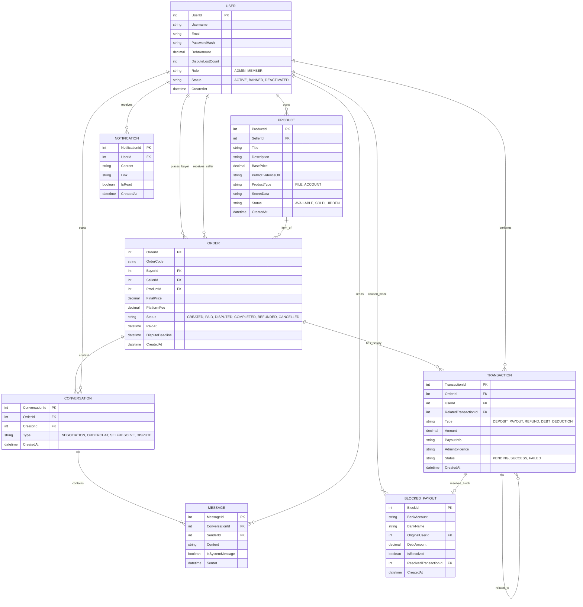

```mermaid
erDiagram
    USER {
        int UserId PK
        string Username
        string Email
        string PasswordHash
        decimal DebtAmount
        int DisputeLostCount
        string Role "ADMIN, MEMBER"
        string Status "ACTIVE, BANNED, DEACTIVATED"
        datetime CreatedAt
    }

    PRODUCT {
        int ProductId PK
        int SellerId FK
        string Title
        string Description
        decimal BasePrice
        string PublicEvidenceUrl
        string ProductType "FILE, ACCOUNT"
        string SecretData
        string Status "AVAILABLE, SOLD, HIDDEN"
        datetime CreatedAt
    }

    ORDER {
        int OrderId PK
        string OrderCode
        int BuyerId FK
        int SellerId FK
        int ProductId FK
        decimal FinalPrice
        decimal PlatformFee
        string Status "CREATED, PAID, DISPUTED, COMPLETED, REFUNDED, CANCELLED"
        datetime PaidAt
        datetime DisputeDeadline
        datetime CreatedAt
    }

    TRANSACTION {
        int TransactionId PK
        int OrderId FK
        int UserId FK
        int RelatedTransactionId FK 
        string Type "DEPOSIT, PAYOUT, REFUND, DEBT_DEDUCTION"
        decimal Amount
        string PayoutInfo
        string AdminEvidence
        string Status "PENDING, SUCCESS, FAILED"
        datetime CreatedAt
    }

    CONVERSATION {
        int ConversationId PK
        int OrderId FK
        int CreatorId FK
        string Type "NEGOTIATION, ORDERCHAT, SELFRESOLVE, DISPUTE"
        datetime CreatedAt
    }

    MESSAGE {
        int MessageId PK
        int ConversationId FK
        int SenderId FK
        string Content
        boolean IsSystemMessage
        datetime SentAt
    }

    NOTIFICATION {
        int NotificationId PK
        int UserId FK
        string Content
        string Link
        boolean IsRead
        datetime CreatedAt
    }

    BLOCKED_PAYOUT {
        int BlockId PK
        string BankAccount
        string BankName
        int OriginalUserId FK
        decimal DebtAmount
        boolean IsResolved
        int ResolvedTransactionId FK
        datetime CreatedAt
    }

    %% --- RELATIONSHIPS ---
    USER ||--o{ PRODUCT : owns
    USER ||--o{ ORDER : places_buyer
    USER ||--o{ ORDER : receives_seller
    
    PRODUCT ||--o{ ORDER : item_of

    ORDER ||--o{ TRANSACTION : has_history
    USER ||--o{ TRANSACTION : performs

    ORDER ||--|{ CONVERSATION : context
    USER ||--o{ CONVERSATION : starts

    CONVERSATION ||--|{ MESSAGE : contains
    USER ||--o{ MESSAGE : sends

    USER ||--o{ NOTIFICATION : receives

    USER ||--o{ BLOCKED_PAYOUT : caused_block
    TRANSACTION ||--o| BLOCKED_PAYOUT : resolves_block
    TRANSACTION ||--o{ TRANSACTION : "related_to"
```
