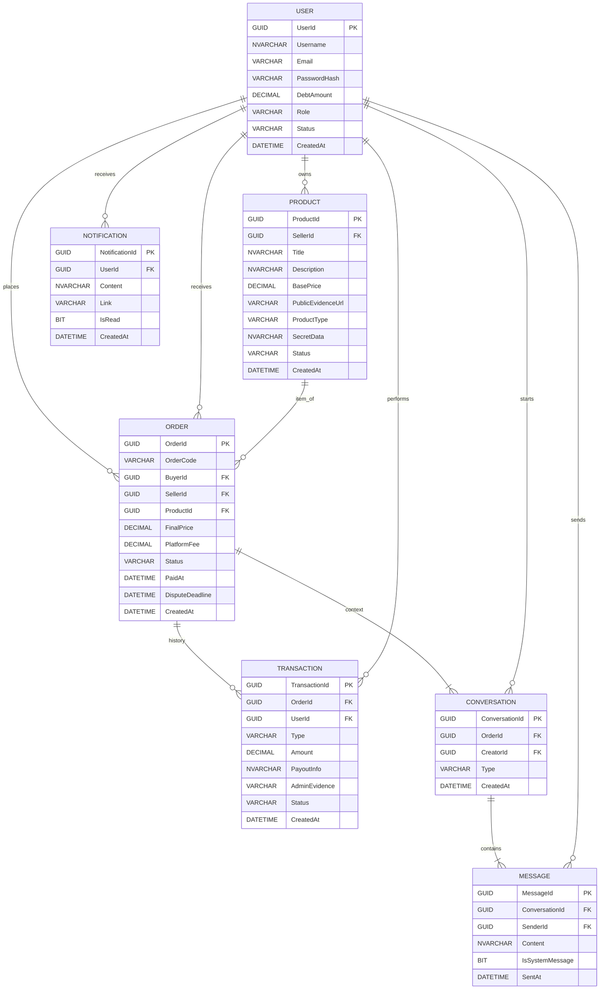

```mermaid
erDiagram

    USER {
        GUID UserId PK
        NVARCHAR Username
        VARCHAR Email
        VARCHAR PasswordHash
        DECIMAL DebtAmount
        VARCHAR Role
        VARCHAR Status
        DATETIME CreatedAt
    }

    PRODUCT {
        GUID ProductId PK
        GUID SellerId FK
        NVARCHAR Title
        NVARCHAR Description
        DECIMAL BasePrice
        VARCHAR PublicEvidenceUrl
        VARCHAR ProductType
        NVARCHAR SecretData
        VARCHAR Status
        DATETIME CreatedAt
    }

    ORDER {
        GUID OrderId PK
        VARCHAR OrderCode
        GUID BuyerId FK
        GUID SellerId FK
        GUID ProductId FK
        DECIMAL FinalPrice
        DECIMAL PlatformFee
        VARCHAR Status
        DATETIME PaidAt
        DATETIME DisputeDeadline
        DATETIME CreatedAt
    }

    TRANSACTION {
        GUID TransactionId PK
        GUID OrderId FK
        GUID UserId FK
        VARCHAR Type
        DECIMAL Amount
        NVARCHAR PayoutInfo
        VARCHAR AdminEvidence
        VARCHAR Status
        DATETIME CreatedAt
    }

    CONVERSATION {
        GUID ConversationId PK
        GUID OrderId FK
        GUID CreatorId FK
        VARCHAR Type
        DATETIME CreatedAt
    }

    MESSAGE {
        GUID MessageId PK
        GUID ConversationId FK
        GUID SenderId FK
        NVARCHAR Content
        BIT IsSystemMessage
        DATETIME SentAt
    }

    NOTIFICATION {
        GUID NotificationId PK
        GUID UserId FK
        NVARCHAR Content
        VARCHAR Link
        BIT IsRead
        DATETIME CreatedAt
    }

    %% --- RELATIONSHIPS ---
    USER ||--o{ PRODUCT : owns
    USER ||--o{ ORDER : places
    USER ||--o{ ORDER : receives
    
    PRODUCT ||--o{ ORDER : item_of

    ORDER ||--o{ TRANSACTION : history
    USER ||--o{ TRANSACTION : performs

    ORDER ||--|{ CONVERSATION : context
    USER ||--o{ CONVERSATION : starts

    CONVERSATION ||--|{ MESSAGE : contains
    USER ||--o{ MESSAGE : sends

    USER ||--o{ NOTIFICATION : receives
```
