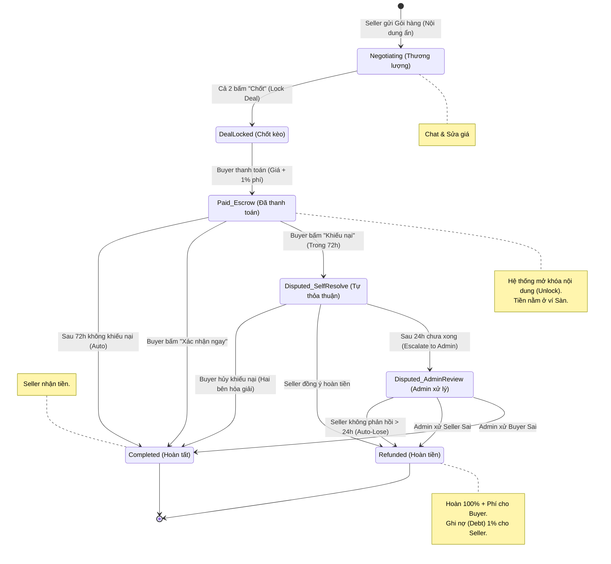

```mermaid
stateDiagram
  direction TB
  [*] --> Neg:Seller gửi Gói hàng (Nội dung ẩn)
  Neg --> Locked:Cả 2 bấm "Chốt" (Lock Deal)
  Locked --> Paid:Buyer thanh toán (Giá + 1% phí)
  Paid --> Done:Sau 72h không khiếu nại (Auto)
  Paid --> Done:Buyer bấm "Xác nhận ngay"
  Paid --> SelfRes:Buyer bấm "Khiếu nại" (Trong 72h)
  SelfRes --> Done:Buyer hủy khiếu nại (Hai bên hòa giải)
  SelfRes --> Refund:Seller đồng ý hoàn tiền
  SelfRes --> AdmRes:Sau 24h chưa xong (Escalate to Admin)
  AdmRes --> Refund:Seller không phản hồi > 24h (Auto-Lose)
  AdmRes --> Refund:Admin xử Seller Sai
  AdmRes --> Done:Admin xử Buyer Sai
  Done --> [*]
  Refund --> [*]
  Neg:Negotiating (Thương lượng)
  Locked:DealLocked (Chốt kèo)
  Paid:Paid_Escrow (Đã thanh toán)
  Done:Completed (Hoàn tất)
  SelfRes:Disputed_SelfResolve (Tự thỏa thuận)
  Refund:Refunded (Hoàn tiền)
  AdmRes:Disputed_AdminReview (Admin xử lý)
  note right of Neg 
  Chat & Sửa giá
  end note
  note right of Paid 
  Hệ thống mở khóa nội dung (Unlock).
        Tiền nằm ở ví Sàn.
  end note
  note right of Refund 
  Hoàn 100% + Phí cho Buyer.
        Ghi nợ (Debt) 1% cho Seller.
  end note
  note left of Done : Seller nhận tiền.
```
